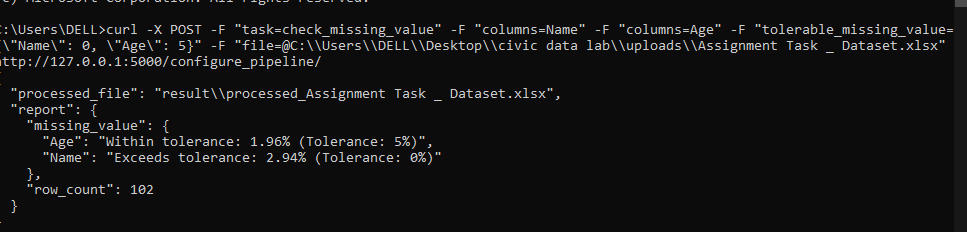
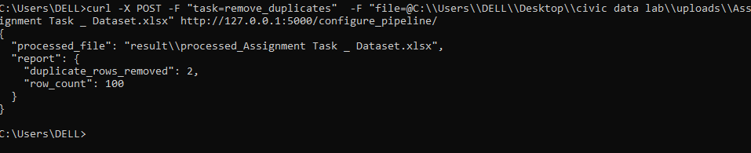
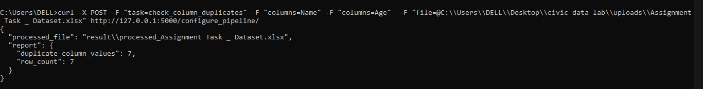

# Civic_data_lab_task
## Task submission for Civic Data Lab

1) For this task I have created two folder one is Uploads folder and other one is the result folder.

2) In upload folder consist of files that is going to be provide by the user

3) In Result folder consist of file which contain processed of original and final and their output 

4) For this task I have been using Flask framework for creating API because it is very light weighted and easy to use and have a less loading time.

5) To run the flask app user have to enter python app.py in cmd terminal it will provide them a local host server in which user can use to fetch the response as per their need.

6) In this I have created a function called configure_pipeline where I am storing all my necessary artifcats related to all task and I can process all those data and store it in result folder.

7) run_pipeline function will execute the pipeline based on the task definition. If a specific task is define then that function will execute that task and create the api for that task.This will also provide a general report for the user and give a brief overview of the result which they are seeking for.

8) check_missing_value function will have data,tolerable_missing_value and columns as a parameter where this function would help in finding the no of missing value on a data. This function will also provide the tolerable missing value of a data in api response format.

HTTP Response:- 
curl -X POST -F "task=check_missing_value" -F "columns=Name" -F "columns=Age" -F "tolerable_missing_value={\"Name\": 0, \"Age\": 5}" -F "file=@C:\\Users\\DELL\\Desktop\\civic data lab\\uploads\\Assignment Task _ Dataset.xlsx" http://127.0.0.1:5000/configure_pipeline/

9) remove_duplicates function are used to remove the duplicate  rows which are duplicated in a data and it will provide the count of duplicate rows that had been found in the data.

HTTP Response:- 
curl -X POST -F "task=remove_duplicates"  -F "file=@C:\\Users\\DELL\\Desktop\\civic data lab\\uploads\\Assignment Task _ Dataset.xlsx" http://127.0.0.1:5000/configure_pipeline/

10) check_column_duplicates function are use to provide the duplicate count on the basis of one column and the combination of different columns that has been provided by the user.

HTTP Response:-
curl -X POST -F "task=check_column_duplicates" -F "columns=Name" -F "columns=Age"  -F "file=@C:\\Users\\DELL\\Desktop\\civic data lab\\uploads\\Assignment Task _ Dataset.xlsx" http://127.0.0.1:5000/configure_pipeline/
